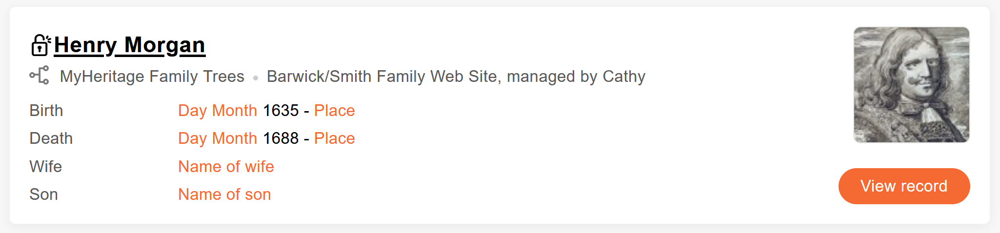

# MH Search Assist

Modifies links in the search results to point directly to the found items. Links modified are marked with an unlocked icon.

## Screenshot

## Installation Instructions

### Google Chrome / Microsoft Edge
1. Download this repo as a [ZIP file from GitHub](https://github.com/hazzik/mh-search-assist/releases/latest/download/mh-search-assist.zip).
2. Unzip the file and you should have a folder named `mh-search-assist`.
3. In Chrome/Edge go to the extensions page (`chrome://extensions` or `edge://extensions`).
4. Enable Developer Mode.
5. Drag the `mh-search-assist` folder anywhere on the page to import it (do not delete the folder afterwards).

### Mozilla Firefox
* [Download and install the latest version](https://github.com/hazzik/mh-search-assist/releases/latest/download/mh-search-assist.xpi)

